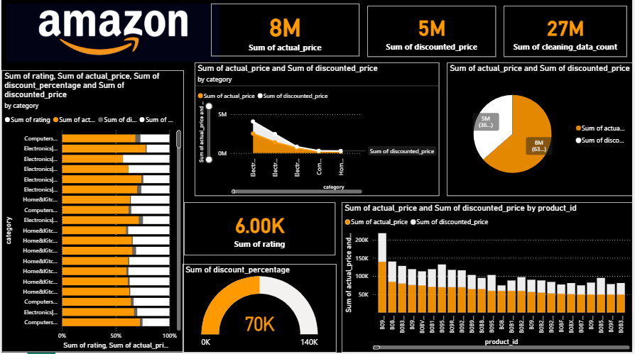

# 🛒 End-to-End Amazon Sales Analysis Dashboard

An end-to-end data analysis project on Amazon product sales data — covering data collection, cleaning, Python-based processing, and interactive Power BI dashboard creation.

---

## 📌 Project Overview

This project analyzes Amazon product sales data to uncover insights about pricing, discounts, ratings, and category performance. The full pipeline covers data sourcing from Kaggle, cleaning in Excel and Python, and visualization in Power BI.

---

## 🛠️ Tools & Technologies

| Tool | Purpose |
|------|---------|
| Kaggle | Dataset sourcing |
| Microsoft Excel | Initial data cleaning |
| Google Colab (Python/Pandas) | Data processing & export |
| Power BI Desktop | Dashboard & visualization |

---

## 📂 Project Structure

```
Amazon-Sales-Analysis-PowerBI/
│
├── amazon - raw data.csv         # Original raw dataset from Kaggle
├── cleaned_amazon_data.csv       # Cleaned dataset (processed via Colab)
├── Untitled9.ipynb               # Google Colab notebook (Python cleaning)
├── Amazon_Sales_Analysis.pbix    # Power BI Dashboard file
├── dashboard_screenshot.png      # Dashboard preview
└── README.md                     # Project documentation
```

---

## 🧹 Data Cleaning Steps

### Excel Cleaning
- Applied filters and sorting
- Removed duplicate rows
- Removed blank/null values
- Formatted text columns
- Cleaned price columns (removed currency symbols)

### Python Cleaning (Google Colab)
```python
import pandas as pd

df = pd.read_csv("amazon - amazon.csv.csv")

# Check missing values
df.isnull().sum()

# Remove duplicates
df.drop_duplicates(inplace=True)

# Drop unwanted columns
df.drop(columns=['unwanted_col'], inplace=True)

# Export cleaned data
df.to_csv("cleaned_amazon_data.csv", index=False)
```

---

## 📊 Dashboard Features (Power BI)

| Visual | Insight |
|--------|---------|
| KPI Cards | Total actual price, discounted price, product count |
| Pie Chart | Sales distribution by category |
| Bar Chart | Actual vs discounted price by category |
| Rating Analysis | Average rating per category |
| Category Analysis | Top performing product categories |

---

## 📈 Key Insights

- Electronics and Computers & Accessories dominate the product listings
- Average discount across all products is significant (60-80% range)
- Higher-rated products tend to have moderate discount percentages
- Home & Kitchen category shows consistent rating above 4.0

---

## 📁 Dataset

- **Source:** Kaggle — Amazon Sales Dataset
- **Columns:** product_id, product_name, category, discounted_price, actual_price, discount_percentage, rating

---
## 📸 Dashboard Preview



## 👩‍💻 Author

**Iniya**
- GitHub: [github.com/iniya-26](https://github.com/iniya-26)
- Internship: TVK Technologies
- Domain: Data Analytics
-
